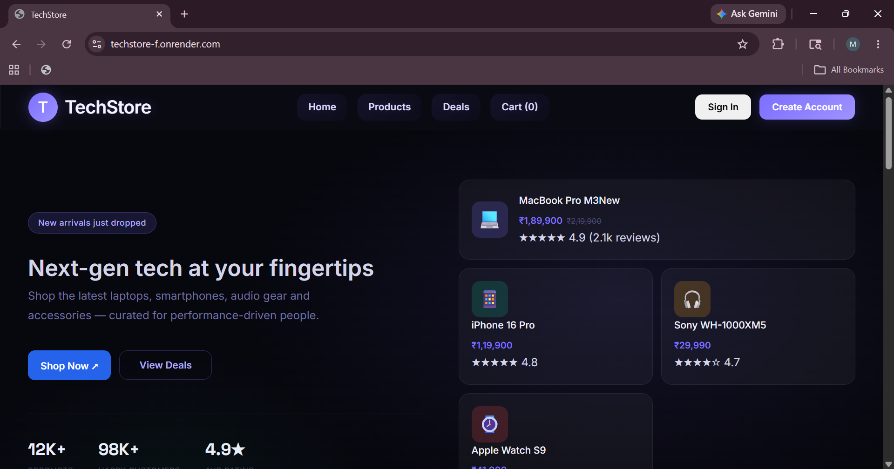
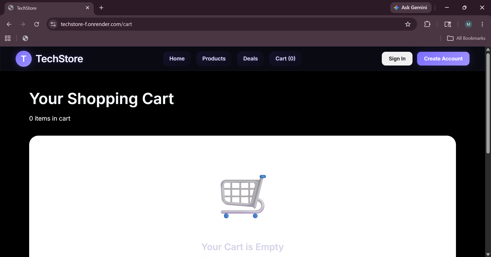
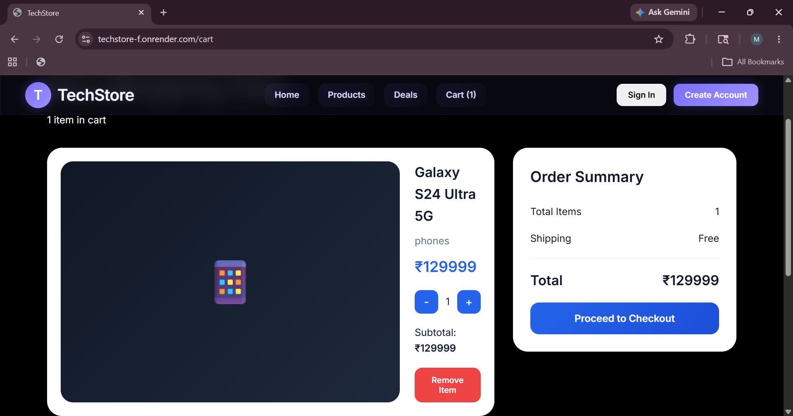
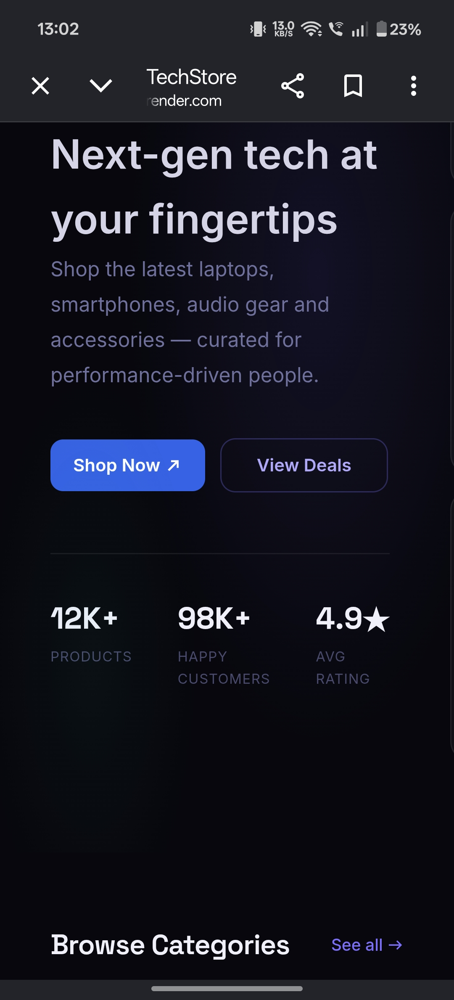
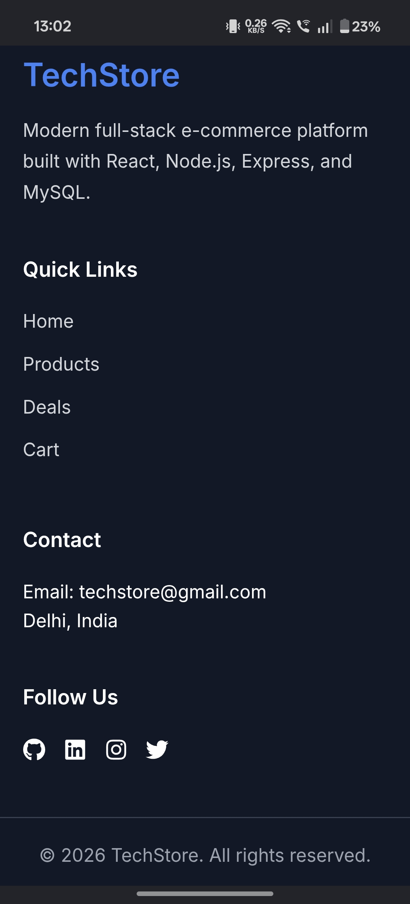

<div align="center">

# 🛒 TechStore

### Modern Full Stack MERN E-Commerce Platform


<br/>


<br/>

[🌐 Live Frontend](https://techstore-f.onrender.com)
•
[⚙ Backend API](https://techstore-trv3.onrender.com)

</div>

---

# 📌 About The Project

TechStore is a modern and scalable full stack e-commerce platform developed using the MERN ecosystem.  
The application focuses on real-world production architecture, authentication workflows, responsive design, and smooth user experience.

It demonstrates:
- Full Stack Development
- Authentication & Authorization
- REST API Architecture
- Database Management
- Modern Responsive UI
- Deployment & Production Configuration

---

# ✨ Key Features

<table>
<tr>
<td width="50%">

## 🔐 Authentication
- JWT Authentication
- Protected Routes
- Login/Register
- Context API Auth State

</td>

<td width="50%">

## 🛒 E-Commerce
- Product Listings
- Dynamic Cart
- Deals Section
- Product Pages

</td>
</tr>

<tr>
<td width="50%">

## 🎨 Frontend
- Responsive UI
- Reusable Components
- Modern Navigation
- Toast Notifications

</td>

<td width="50%">

## ⚙ Backend
- Express REST APIs
- Middleware System
- MVC Architecture
- MySQL Integration

</td>
</tr>
</table>

---

# 🖼️ Project Preview

## 🏠 Homepage


---

## 🛍️ Product Page


---

## 🛒 Shopping Cart



---

## 📱 Mobile Responsive Design



---

# 🧠 Tech Stack

## Frontend
```bash
React.js
Vite
React Router DOM
Context API
CSS3
```

## Backend
```bash
Node.js
Express.js
JWT Authentication
bcrypt.js
```

## Database
```bash
MySQL
```

## Deployment
```bash
Render
Railway
```

---

# 📂 Project Architecture

```bash
Techstore-main/
│
├── client/
│   ├── components/
│   ├── pages/
│   ├── context/
│   ├── hooks/
│   ├── api/
│   └── data/
│
├── Server/
│   ├── Controllers/
│   ├── routes/
│   ├── middleware/
│   ├── config/
│   └── Server.js
│
└── database.sql
```

---

# ⚡ Installation

## Clone Repository

```bash
git clone https://github.com/Mridulhasija/TechStore.git
```

## Install Frontend

```bash
cd client
npm install
```

## Install Backend

```bash
cd ../Server
npm install
```

---

# ▶ Run Project

## Start Backend

```bash
npm run dev
```

## Start Frontend

```bash
npm run dev
```

---

# 📌 API Endpoints

| Method | Endpoint | Description |
|---|---|---|
| POST | `/api/auth/register` | Register User |
| POST | `/api/auth/login` | Login User |
| GET | `/api/products` | Fetch Products |
| GET | `/api/products/:id` | Product Details |
| POST | `/api/cart/add` | Add To Cart |

---

# 💡 Learnings

This project helped me strengthen my understanding of:

- Full Stack Architecture
- REST APIs
- JWT Authentication
- Database Integration
- React State Management
- Deployment Pipelines
- Clean Scalable Code Structure

---

# 🚀 Future Enhancements

- Payment Gateway
- Admin Dashboard
- Product Filters
- Wishlist System
- Order Tracking
- Dark Mode

---

# 👨‍💻 Developer

## Mridul Hasija

### Aspiring Full Stack MERN Developer

Passionate about building scalable, responsive, and user-centric web applications.

### Connect With Me

- GitHub: https://github.com/Mridulhasija
- Linkedin: https://www.linkedin.com/in/mridul-hasija-290996329/

---

<div align="center">

# ⭐ If You Like This Project

Give it a ⭐ on GitHub and support the project.

</div>
