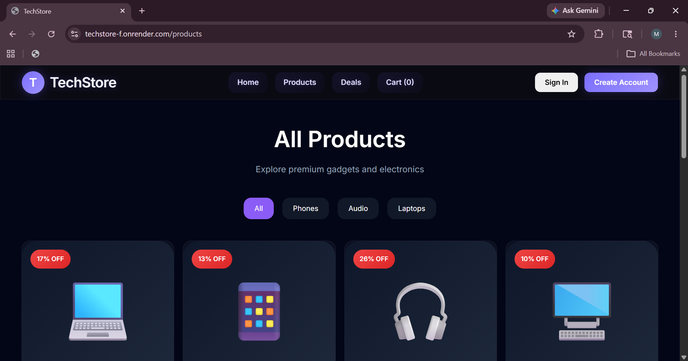

# TechStore — Full Stack Ecommerce Web Application
<div align="center">


### Modern Full Stack Ecommerce Platform Built With React, Node.js, Express &
MYSQL
</div>
---
# Live Deployment
## Frontend Live
https://techstore-f.onrender.com/
## Backend API Live
(Add your backend Render deployment link here)
---
# Project Screenshots
## Homepage

---
## Products Page

---
## Cart Page

---
## Mobile Responsive UI

---
# Features
## Frontend Features
- Modern Responsive UI
- Emoji-Based Product Cards
- Dynamic Cart Functionality
- Product Detail Pages
- Similar Product Recommendations
- Responsive Navbar
- Toast Notifications
- Mobile Friendly Design
- Professional Ecommerce Layout
- Dynamic Routing
- Context API State Management
- Dark Themed Premium UI
---
## Backend Features
- REST API Architecture
- Authentication System
- MYSQL Integration
- Express Middleware
- JWT Authentication
- Secure API Endpoints
- Error Handling
- API Routing
---
# Tech Stack
| Frontend | Backend | Database | Deployment |
|----------|----------|-----------|-------------|
| React.js | Node.js | MySQL | Render |
| Vite | Express.js | Mongoose | GitHub |
| CSS3 | REST API | MYSQL Workbench 8.0 CE | Render |
| React Router | JWT | | |
---
# 🏗️ Project Architecture

## Frontend (React + Vite)

The frontend is built using React.js with Vite for high performance and optimized builds.  
It includes reusable components, dynamic routing, responsive ecommerce UI, Context API state management, toast notifications, and mobile-first design.

## Backend (Node.js + Express)

The backend follows REST API architecture using Express.js.  
It handles authentication, cart management, product APIs, middleware security, and MongoDB database integration.

## Database

The project integrates MYSQL for scalable data storage and also includes SQL structure reference through `database.sql`.

## Deployment

- Frontend deployed on Render
- Backend deployed on Render
- Production-ready MERN stack structure
---
# 📂 Folder Structure

```bash
Techstore-main/
│
├── client/
│   │
│   ├── src/
│   │   │
│   │   ├── api/
│   │   ├── components/
│   │   ├── context/
│   │   ├── data/
│   │   ├── hooks/
│   │   ├── pages/
│   │   │
│   │   ├── App.jsx
│   │   ├── main.jsx
│   │   └── index.css
│   │
│   ├── .env
│   ├── index.html
│   ├── package.json
│   └── vite.config.js
│
├── Server/
│   │
│   ├── Controllers/
│   │   ├── authController.js
│   │   ├── cartController.js
│   │   └── productController.js
│   │
│   ├── config/
│   │   └── db.js
│   │
│   ├── middleware/
│   │   └── authMiddleware.js
│   │
│   ├── routes/
│   │   ├── authRoutes.js
│   │   ├── cartRoutes.js
│   │   └── productRoutes.js
│   │
│   ├── .env
│   ├── Server.js
│   ├── package.json
│   └── package-lock.json
│
├── database.sql
└── README.md
```
